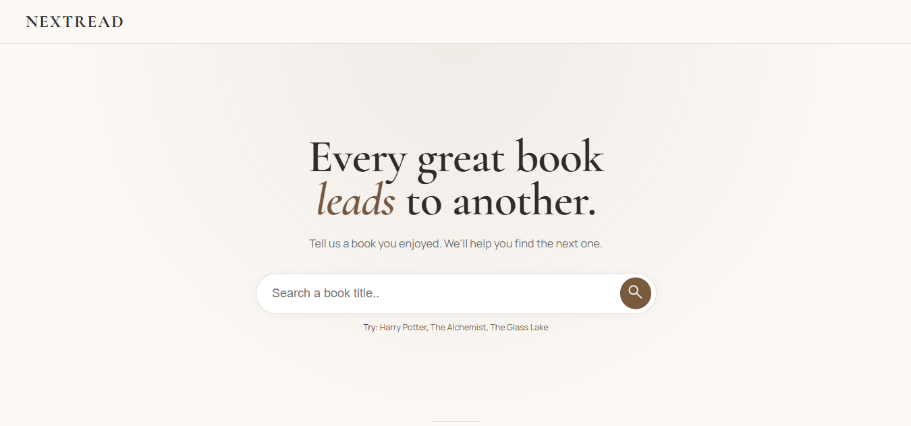
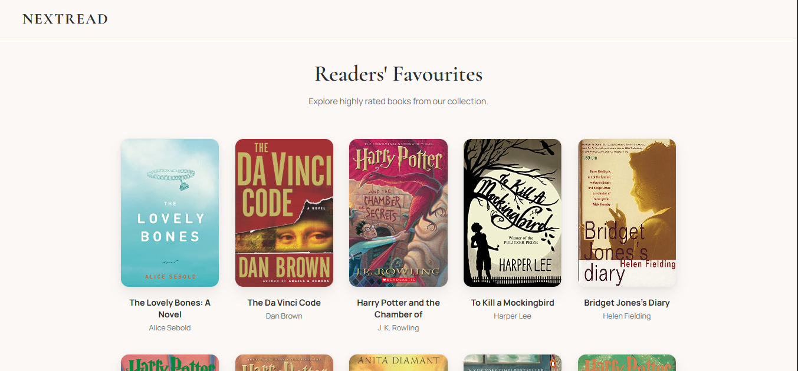
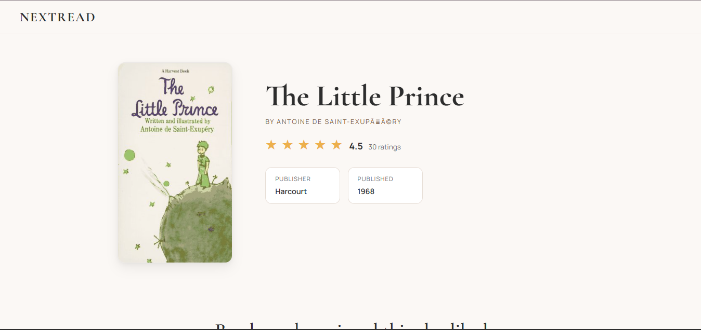
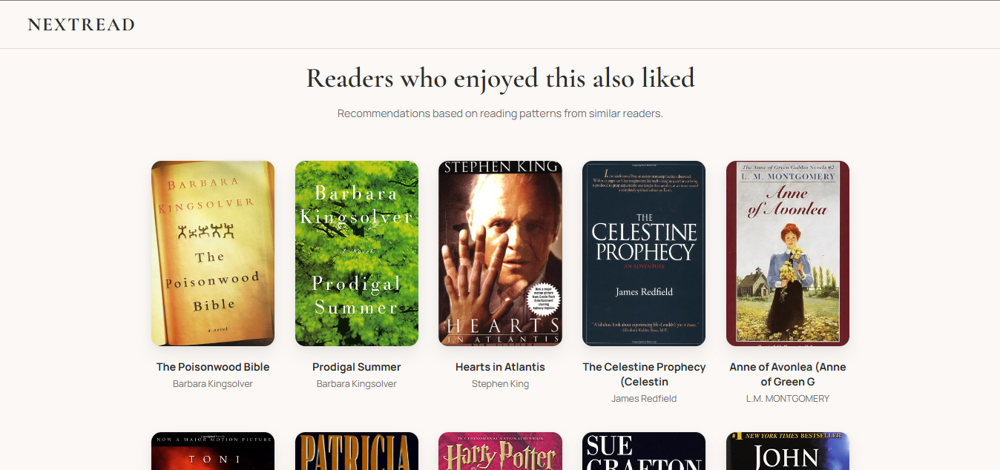
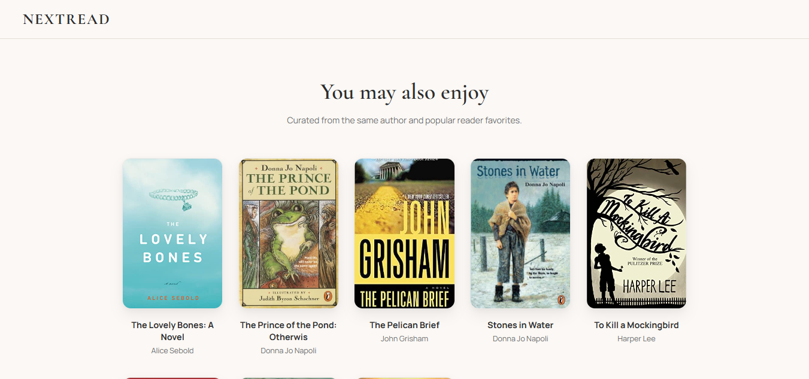
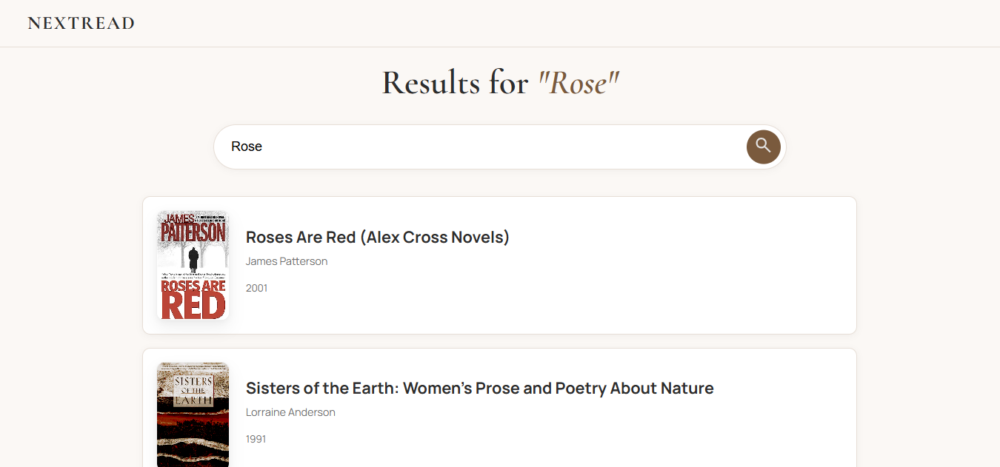

# NextRead (Book Recommendar)

A collaborative filtering based book recommendation web application that helps readers discover books similar to the ones they already enjoy. The system analyzes user rating patterns and generates recommendations using cosine similarity.

## Features

* Search books by title
* Browse popular books on the homepage
* View detailed book information including author, publisher, publication year, and ratings
* Get similar book recommendations using cosine similarity
* Fallback recommendations based on the same author and highly rated books
* Handling of missing book covers

## Application Preview

### Homepage

### Book Details & Recommendations

### Fallback Recommendations

When a selected book does not have enough rating data for collaborative filtering, NextRead provides fallback recommendations based on the same author and popular reader favourites.

### Search Results

## Tech Stack

* Flask
* Pandas
* Scikit-learn
* HTML
* CSS
* JavaScript

## Dataset

The recommendation model uses the Book-Crossing Dataset from Kaggle, containing user ratings and book metadata.

## Recommendation System

The application creates a user-book rating matrix and computes cosine similarity between books.

Recommendations are generated using collaborative filtering, where books with similar user rating patterns are suggested to the reader.

If a selected book is not available in the recommendation matrix, the application recommends books by the same author along with popular highly-rated books.

